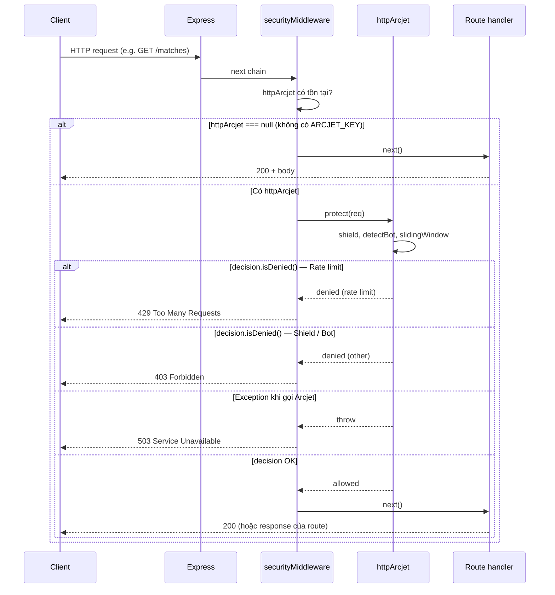
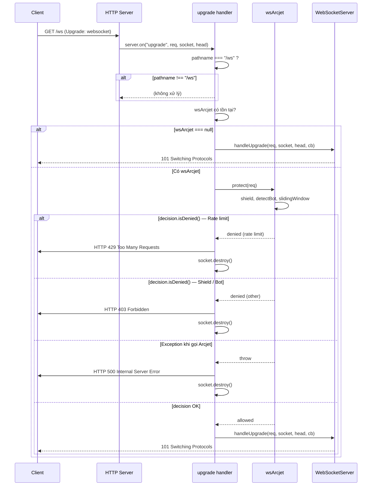

# Arcjet — Bảo vệ HTTP & WebSocket

Tài liệu mô tả cách dự án dùng **Arcjet** (`@arcjet/node`) để bảo vệ REST API và WebSocket: rate limit, shield, detect bot.

---

## 1. Tổng quan

- **Vai trò:** Bảo vệ ứng dụng trước abuse (quá tải request, bot, tấn công).
- **Phạm vi:**
  - **HTTP:** Middleware Express áp dụng cho mọi route (trước `/matches`, `/matches/:id/commentary`).
  - **WebSocket:** Kiểm tra tại thời điểm **upgrade** (trước khi chuyển sang WebSocket); nếu bị từ chối thì trả 429/403 và `socket.destroy()`.
- **File cấu hình:** `src/arcjet.js` — export `httpArcjet`, `wsArcjet`, `securityMiddleware()`.

```text
HTTP request  →  securityMiddleware()  →  httpArcjet.protect(req)  →  next() hoặc 429/403/503
WS upgrade    →  server.on("upgrade") →  wsArcjet.protect(req)    →  handleUpgrade hoặc 429/403 + destroy
```

---

## 2. Biến môi trường

| Biến | Bắt buộc | Mô tả |
|------|----------|--------|
| `ARCJET_KEY` | Có (khi dùng Arcjet) | API key từ [Arcjet Dashboard](https://app.arcjet.com). Thiếu key thì `httpArcjet` / `wsArcjet` = null, middleware và WS upgrade bỏ qua Arcjet. |
| `ARCJECT_MODE` | Không | Ghi đúng: `ARCJECT_MODE` (một chữ **J**). Giá trị `DRY_RUN` = chỉ log, không chặn; mặc định = `LIVE` (chặn thật). |

**Ví dụ `.env`:**
```env
ARCJET_KEY=ajkey_xxxx
# ARCJECT_MODE=DRY_RUN   # bật khi muốn test mà không chặn
```

**Development:** Có thể không set `ARCJET_KEY` để chạy app không qua Arcjet (tránh warning "use 127.0.0.1 when missing public IP"). Khi đó cần đảm bảo code không `throw` khi thiếu key (chỉ export null).

---

## 3. Cấu hình HTTP (`httpArcjet`)

Áp dụng cho **mọi HTTP request** qua `app.use(securityMiddleware())` trong `src/index.js`.

| Rule | Tham số | Ý nghĩa |
|------|---------|----------|
| **shield** | `mode: arcjetMode` | Chặn request nguy hiểm (shield của Arcjet). |
| **detectBot** | `mode`, `allow: ["CATEGORY:SEARCH_ENGINE", "CATEGORY:PREVIEW"]` | Phát hiện bot; cho phép search engine và preview (vd: link preview). |
| **slidingWindow** | `mode`, `interval: "10s"`, `max: 50` | Rate limit: tối đa **50 request / 10 giây** trên mỗi IP. Vượt → 429. |

---

## 4. Cấu hình WebSocket (`wsArcjet`)

Áp dụng **chỉ tại upgrade** (trước khi handshake WebSocket), trong `src/ws/server.js`.

| Rule | Tham số | Ý nghĩa |
|------|---------|----------|
| **shield** | `mode: arcjetMode` | Giống HTTP. |
| **detectBot** | `mode`, `allow: [...]` | Giống HTTP. |
| **slidingWindow** | `interval: "2s"`, `max: 5` | Rate limit **chặt hơn**: 5 upgrade / 2 giây / IP — tránh mở quá nhiều WS connection. |

Khi `decision.isDenied()`:
- **Rate limit** → gửi `HTTP/1.1 429 Too Many Requests` rồi `socket.destroy()`.
- **Lý do khác** (vd: bot bị chặn) → `HTTP/1.1 403 Forbidden` rồi `socket.destroy()`.
- **Lỗi khi gọi Arcjet** → `HTTP/1.1 500` rồi `socket.destroy()`.

---

## 5. Middleware HTTP (`securityMiddleware`)

- **Vị trí:** `app.use(securityMiddleware())` — đặt **trước** các route (`/matches`, ...) để mọi request đều qua Arcjet.
- **Luồng:**
  1. Nếu `httpArcjet` null (không có key) → `next()`.
  2. Gọi `httpArcjet.protect(req)`.
  3. Nếu `decision.isDenied()`:
     - **Rate limit** → `429` + `{ error: "Too many requests." }`.
     - **Khác** → `403` + `{ error: "Forbidden." }`.
  4. Nếu có exception → log và trả `503 Service Unavailable`.
  5. Ngược lại → `next()`.

---

## 6. WebSocket upgrade (trong `attachWebSocketServer`)

- Chỉ xử lý khi **pathname === "/ws"**.
- Nếu có `wsArcjet`: gọi `wsArcjet.protect(req)`; nếu bị từ chối hoặc lỗi thì ghi HTTP response (429/403/500) và `socket.destroy()`, **không** gọi `wss.handleUpgrade`.
- Chỉ khi Arcjet cho phép (hoặc không bật) mới gọi `wss.handleUpgrade(req, socket, head, ...)`.

---

## 7. Sequence diagram — Luồng HTTP (securityMiddleware)

Mọi HTTP request (vd: `GET /matches`) đều đi qua middleware trước khi tới route.



---

## 8. Sequence diagram — Luồng WebSocket upgrade

Chỉ khi client gửi request upgrade lên path `/ws`, server mới kiểm tra Arcjet trước khi hoàn tất handshake.



---

## 9. Test rate limit (thực hành)

**HTTP:** Gửi nhiều request vượt ngưỡng 50/10s (vd: 60 request liên tiếp):

```bash
for i in {1..60}; do curl -s -o /dev/null -w "%{http_code}\n" http://localhost:8000/matches; done
```

Kỳ vọng: phần đầu trả `200`, sau khi vượt limit sẽ có `429`.

**WebSocket:** Mở nhiều kết nối WS trong 2 giây (vd: script mở 6+ tab/client cùng lúc tới `ws://localhost:8000/ws`). Kỳ vọng: một số connection nhận 429 và bị đóng.

---

## 10. Mã HTTP trả về

| Code | Nguồn | Ý nghĩa |
|------|--------|---------|
| **429** | Arcjet (rate limit) | Vượt quá số request/connection cho phép trong khoảng thời gian. |
| **403** | Arcjet (shield / bot) | Request hoặc upgrade bị chặn (vd: bot không nằm trong allow list). |
| **503** | Middleware HTTP (catch) | Lỗi khi gọi Arcjet (network, API…). |

---

## 11. Cảnh báo thường gặp

**"Arcjet will use 127.0.0.1 when missing public IP address in development mode"**

- **Nguyên nhân:** Ở local, request từ localhost nên không có IP công khai (hoặc chỉ 127.0.0.1). Arcjet cần IP để rate limit / phân tích; khi không có (hoặc không đọc được từ proxy), nó dùng 127.0.0.1 và in cảnh báo.
- **Ảnh hưởng:** Chỉ là warning; app vẫn chạy, rate limit vẫn theo IP (trong dev thường là cùng một IP).
- **Cách giảm warning:** Chạy dev không dùng Arcjet (không set `ARCJET_KEY` và không throw khi thiếu key trong dev). Production đằng sau proxy (vd: Nginx, Vercel) sẽ có header `X-Forwarded-For` / `X-Real-IP` nên Arcjet lấy được IP thật và warning thường không xuất hiện.

---

## 12. Tóm tắt

| Thành phần | File | Mô tả |
|------------|------|--------|
| Cấu hình HTTP + WS | `src/arcjet.js` | `httpArcjet`, `wsArcjet` (rules: shield, detectBot, slidingWindow), `securityMiddleware()`. |
| Gắn HTTP | `src/index.js` | `app.use(securityMiddleware())` trước các route. |
| Gắn WS | `src/ws/server.js` | Trong `server.on("upgrade")`, gọi `wsArcjet.protect(req)` trước `handleUpgrade`. |
| Env | `.env` | `ARCJET_KEY` (bắt buộc nếu dùng Arcjet), `ARCJECT_MODE` (tùy chọn, DRY_RUN / LIVE). |

Tài liệu WebSocket: **docs/websocket-flow.md**. REST API: **docs/rest-api-matches-commentary.md**.
