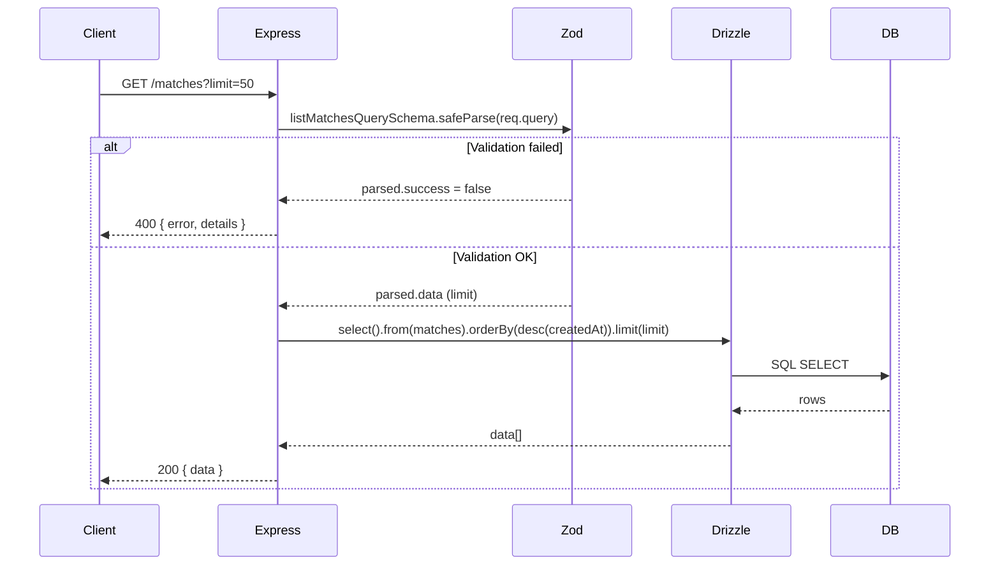
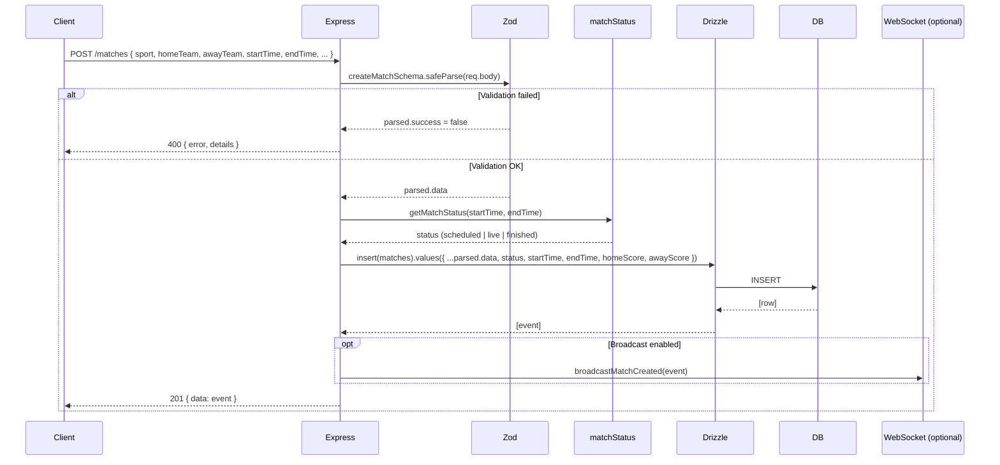
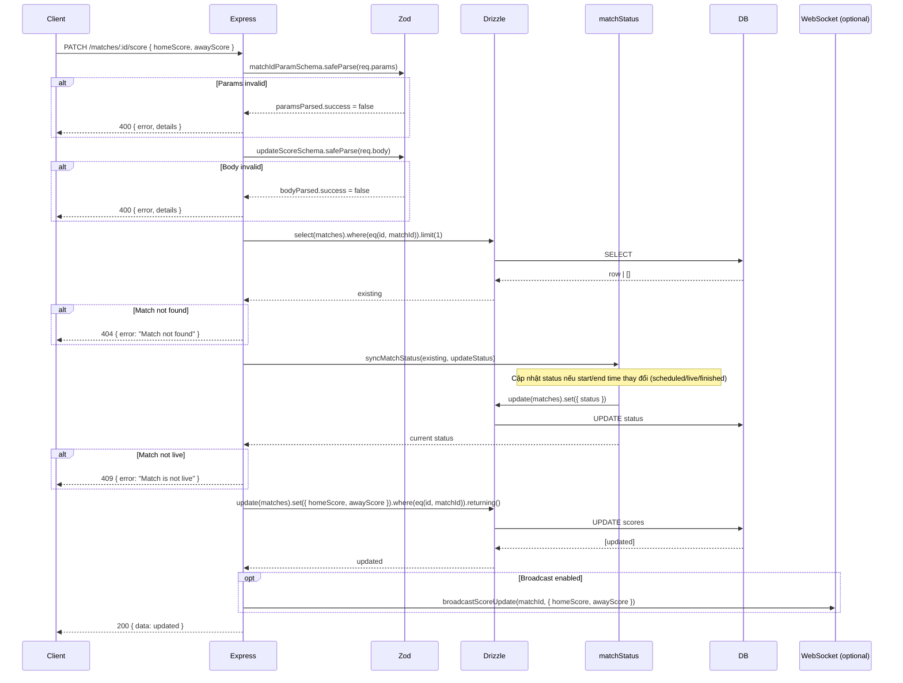
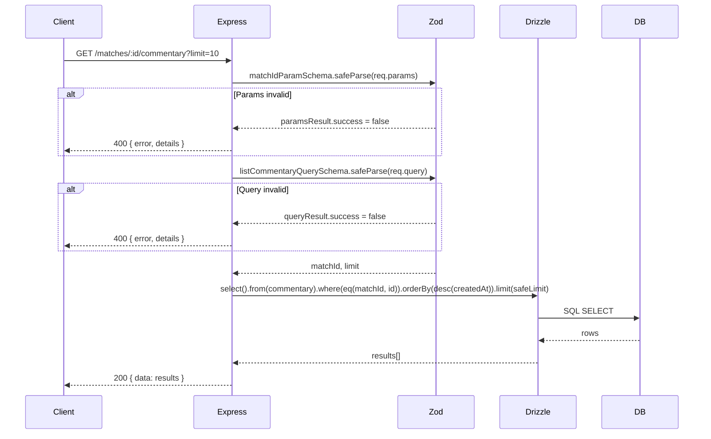
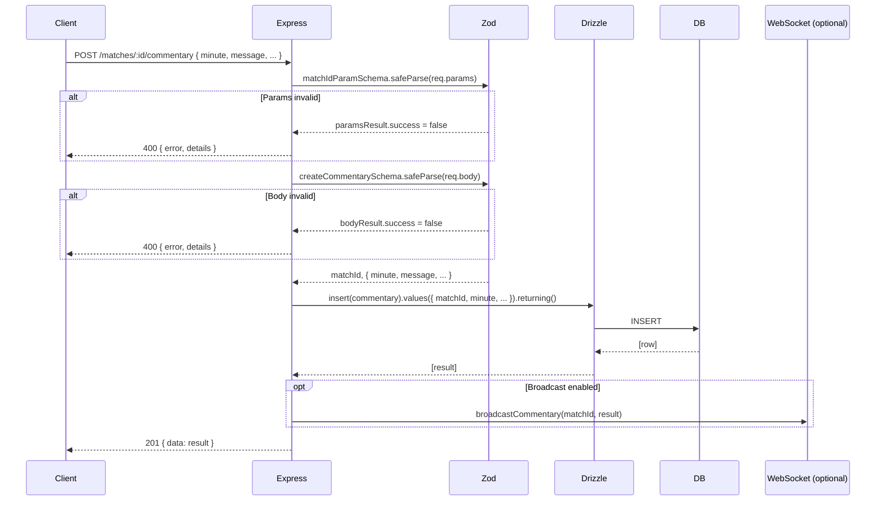
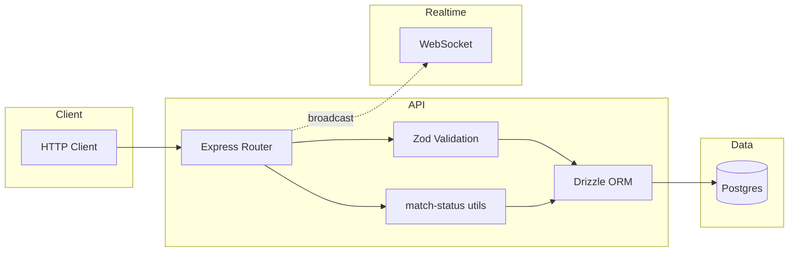

# REST API: Matches & Commentary — Luồng & Sequence Diagram

Tài liệu mô tả luồng xử lý REST API cho **Matches** và **Commentary**, kèm sequence diagram cho từng endpoint.

---

## 1. Tổng quan

| Base path | Mô tả |
|-----------|--------|
| `GET/POST /matches` | Danh sách trận đấu, tạo trận đấu mới |
| `PATCH /matches/:id/score` | Cập nhật tỉ số (chỉ khi match đang **live**) |
| `GET/POST /matches/:id/commentary` | Danh sách / tạo bình luận theo trận |

**Công nghệ:** Express, Drizzle ORM (Neon/Postgres), Zod validation. Optional: WebSocket broadcast (match created, score update, commentary).

---

## 2. Bảng endpoint

| Method | Path | Mô tả | Body/Query |
|--------|------|--------|------------|
| `GET` | `/matches` | Danh sách matches (phân trang) | Query: `limit` (optional, max 100) |
| `POST` | `/matches` | Tạo match mới | Body: sport, homeTeam, awayTeam, startTime, endTime, homeScore?, awayScore? |
| `PATCH` | `/matches/:id/score` | Cập nhật tỉ số | Params: `id`; Body: homeScore, awayScore |
| `GET` | `/matches/:id/commentary` | Danh sách commentary của match | Params: `id`; Query: `limit` (optional) |
| `POST` | `/matches/:id/commentary` | Tạo commentary mới | Params: `id`; Body: minute, message, sequence?, period?, eventType?, actor?, team?, metadata?, tags? |

---

## 3. Sequence diagram — GET /matches (List matches)

**Luồng ngắn:** Validate query (limit) → Query DB → Trả về danh sách match, sắp xếp mới nhất trước.

---

## 4. Sequence diagram — POST /matches (Create match)

**Luồng ngắn:** Validate body (sport, teams, start/end time, scores) → Tính `status` từ thời gian → INSERT → (optional) broadcast WebSocket → 201 + match vừa tạo.

---

## 5. Sequence diagram — PATCH /matches/:id/score (Update score)

**Luồng ngắn:** Validate params (id) và body (scores) → Lấy match hiện tại → Đồng bộ status (syncMatchStatus) → Nếu không phải **live** thì 409 → UPDATE score → (optional) broadcast → 200.

---

## 6. Sequence diagram — GET /matches/:id/commentary (List commentary)

**Luồng ngắn:** Validate `:id` và query `limit` → SELECT commentary theo `matchId`, sắp xếp mới nhất → 200.

---

## 7. Sequence diagram — POST /matches/:id/commentary (Create commentary)

**Luồng ngắn:** Validate `:id` và body (minute, message, ...) → INSERT commentary với `matchId` từ URL → (optional) broadcast → 201.

---

## 8. Sơ đồ tổng hợp luồng (High-level)

---

## 9. Validation schema tóm tắt

### Matches

| Schema | Dùng cho | Trường chính |
|--------|----------|--------------|
| `listMatchesQuerySchema` | GET /matches | `limit` (optional, 1–100) |
| `matchIdParamSchema` | :id trong URL | `id` (số nguyên dương) |
| `createMatchSchema` | POST /matches | sport, homeTeam, awayTeam, startTime (ISO), endTime (ISO), homeScore?, awayScore?; endTime > startTime |
| `updateScoreSchema` | PATCH .../score | homeScore, awayScore (số nguyên ≥ 0) |

### Commentary

| Schema | Dùng cho | Trường chính |
|--------|----------|--------------|
| `listCommentaryQuerySchema` | GET .../commentary | `limit` (optional, 1–100) |
| `createCommentarySchema` | POST .../commentary | minute (int ≥ 0), message (required), sequence?, period?, eventType?, actor?, team?, metadata?, tags? |

---

## 10. Mã lỗi HTTP

| Code | Ý nghĩa |
|------|----------|
| `200` | Thành công (GET, PATCH) |
| `201` | Tạo thành công (POST) |
| `400` | Query/params/body không hợp lệ (Zod) |
| `404` | Match không tồn tại (PATCH score, GET/POST commentary) |
| `409` | Match không ở trạng thái live (PATCH score) |
| `500` | Lỗi server / DB |

---

## 11. Ghi chú

- **Match status:** Tính từ `startTime`/`endTime` (scheduled → live → finished). `syncMatchStatus` dùng khi update score để đảm bảo status khớp với thời gian.
- **WebSocket:** Nếu mount WS server và gán `broadcastMatchCreated`, `broadcastScoreUpdate`, `broadcastCommentary` vào `app.locals`, các event tương ứng sẽ được broadcast sau khi tạo match, cập nhật score, hoặc tạo commentary.
- **Commentary** luôn gắn với một match qua `matchId` (foreign key); list/create đều dựa trên `:id` trong URL.

Tài liệu này mô tả đầy đủ luồng REST API cho matches và commentary, kèm sequence diagram có thể render bằng Mermaid (GitHub, VS Code, hoặc [mermaid.live](https://mermaid.live)).
