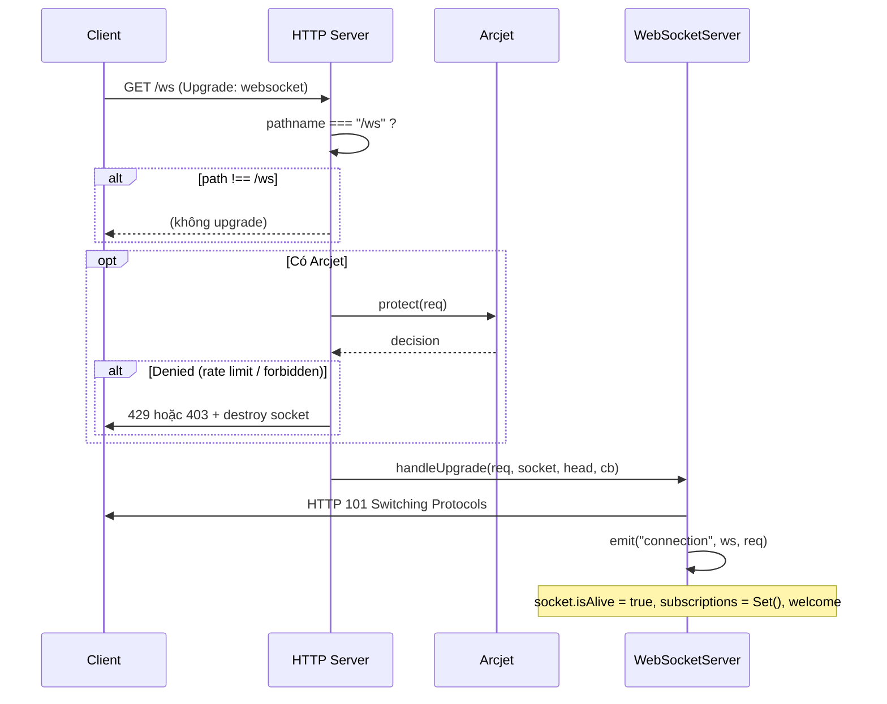
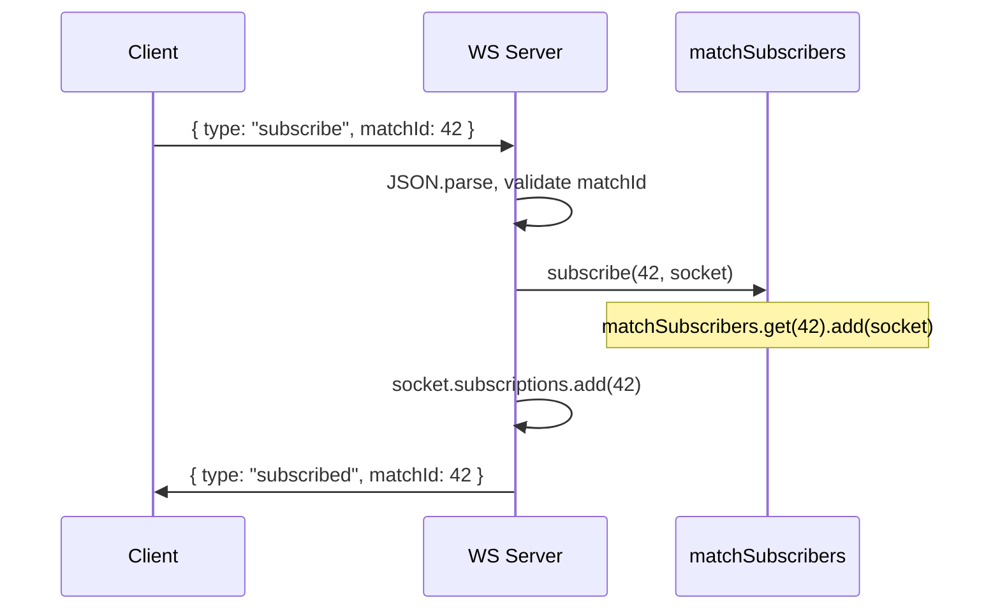
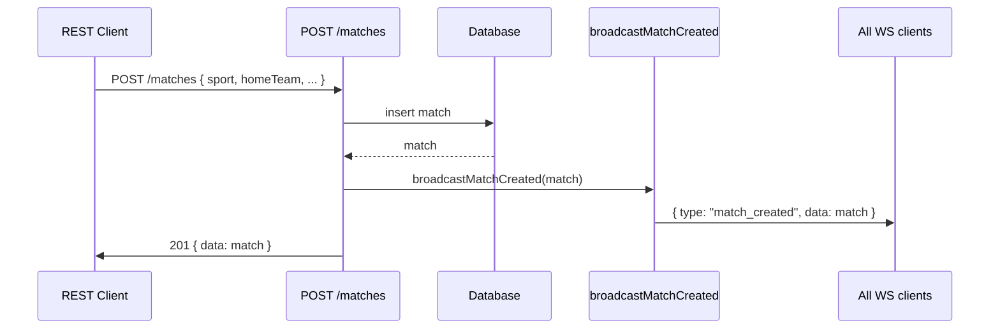
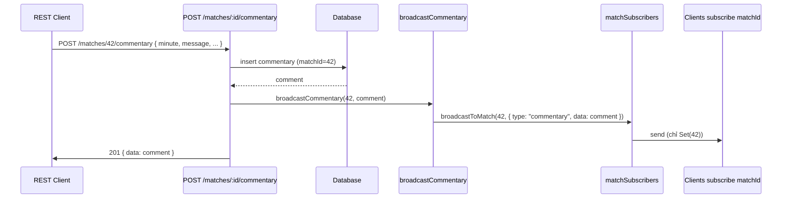
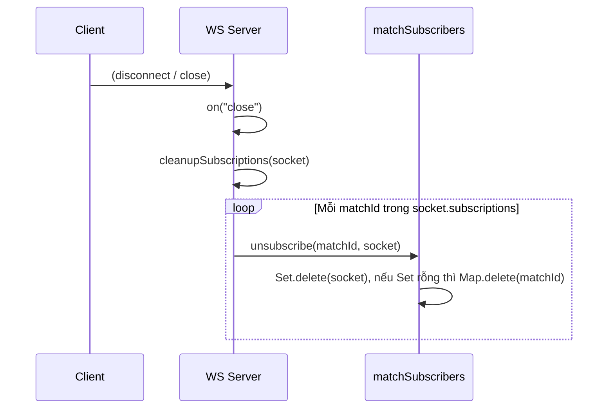

# Luồng WebSocket — Real-Time Sports Broadcast

Tài liệu mô tả luồng WebSocket của dự án: kết nối, subscribe/unsubscribe theo trận, broadcast vs multicast, heartbeat và tích hợp với REST API.

---

## 1. Tổng quan

- **Path:** `ws://<host>:<port>/ws` (cùng HTTP server, upgrade trên path `/ws`).
- **Vai trò:** Push real-time khi có trận mới (broadcast) và khi có commentary/score theo từng trận (multicast).
- **File chính:** `src/ws/server.js` — `attachWebSocketServer(server)` gắn vào HTTP server, trả về `broadcastMatchCreated`, `broadcastCommentary` để REST route gọi.

```text
Client  <--WebSocket-->  Server (ws/server.js)
                              ^
                              | app.locals.broadcastMatchCreated / broadcastCommentary
                              |
REST (POST /matches, POST /matches/:id/commentary)  -->  Route gọi broadcast
```

---

## 2. Luồng kết nối (Connection & Upgrade)



- Chỉ upgrade khi **pathname === "/ws"**.
- Nếu bật **Arcjet:** kiểm tra trước khi upgrade; từ chối thì trả 429 (rate limit) hoặc 403 và `socket.destroy()`.
- Sau upgrade: **connection** → khởi tạo `socket.subscriptions` (Set), gửi **welcome**, đăng ký message/error/close.

---

## 3. Envelope (Định dạng message)

Mọi message đều là JSON với ít nhất **type** (và **data** khi có payload). Client và server đều dùng chung pattern.

### Server → Client

| type | Ý nghĩa | Khi nào |
|------|--------|---------|
| `welcome` | Kết nối thành công | Ngay sau khi connection (handshake xong). |
| `subscribed` | Đã subscribe một trận | Phản hồi sau khi xử lý `subscribe` (kèm `matchId`). |
| `unsubscribed` | Đã unsubscribe | Phản hồi sau khi xử lý `unsubscribe` (kèm `matchId`). |
| `match_created` | Có trận mới | Broadcast khi REST **POST /matches** tạo trận (payload: `data` = match). |
| `commentary` | Bình luận mới của trận | Multicast khi REST **POST /matches/:id/commentary** tạo commentary (payload: `data` = comment). |
| `error` | Lỗi (vd: invalid JSON) | Khi parse body client gửi lỗi hoặc logic báo lỗi (kèm `message`). |

### Client → Server

| type | Payload | Ý nghĩa |
|------|---------|---------|
| `subscribe` | `matchId` (number) | Đăng ký nhận event của trận `matchId` (commentary, sau này có thể thêm score). |
| `unsubscribe` | `matchId` (number) | Hủy đăng ký trận `matchId`. |

Ví dụ client gửi:

```json
{ "type": "subscribe", "matchId": 42 }
```

Server phản hồi:

```json
{ "type": "subscribed", "matchId": 42 }
```

---

## 4. Subscription (Room / Multicast)

- **Registry:** `matchSubscribers = Map<matchId, Set<WebSocket>>`.
- **Subscribe:** Client gửi `{ type: "subscribe", matchId }` → server thêm socket vào `matchSubscribers.get(matchId)` (tạo Set nếu chưa có) và lưu `matchId` vào `socket.subscriptions`.
- **Unsubscribe:** Client gửi `{ type: "unsubscribe", matchId }` → server xóa socket khỏi Set; nếu Set rỗng thì xóa key `matchId` khỏi Map.
- **Cleanup:** Khi socket **close**, server gọi `cleanupSubscriptions(socket)` (duyệt `socket.subscriptions` và unsubscribe từng matchId) để tránh ghost connections và giữ registry đúng.

Chỉ client nằm trong `matchSubscribers.get(matchId)` mới nhận event **commentary** (và sau này có thể thêm score) của trận đó — đây là **multicast** (one-to-many theo room).

---

## 5. Broadcast vs Multicast

| Loại | Hàm | Event | Đối tượng nhận |
|------|-----|--------|----------------|
| **Broadcast** | `broadcastToAll` | `match_created` | Mọi client đang kết nối (readyState === OPEN). |
| **Multicast** | `broadcastToMatch(matchId, …)` | `commentary` | Chỉ client đã subscribe `matchId`. |

- **Match created:** Mọi client đều nhận (danh sách trận / thông báo có trận mới).
- **Commentary:** Chỉ client đang “xem” trận đó (đã gửi `subscribe` với `matchId` tương ứng).

---

## 6. Heartbeat (Ping / Pong)

- Mỗi socket có `isAlive` (ban đầu `true`).
- Khi nhận **pong**, server set `socket.isAlive = true`.
- Mỗi **30 giây** server duyệt tất cả client: set `isAlive = false`, gửi **ping**. Lần sau (30s sau), nếu `isAlive` vẫn `false` (không nhận được pong) thì **terminate** socket.
- Mục đích: phát hiện connection chết (mất mạng, đóng tab không gửi close) để không giữ socket và không gửi message vào socket đã chết — tránh ghost connections.

---

## 7. Luồng Subscribe (Client đăng ký nhận commentary)



Sau đó mọi event **commentary** của matchId 42 chỉ gửi cho các socket trong `matchSubscribers.get(42)`.

---

## 8. Luồng REST → WebSocket (Match created)



- REST tạo trận xong gọi `app.locals.broadcastMatchCreated(match)`.
- WebSocket server broadcast `{ type: "match_created", data: match }` tới **mọi** client đang mở.

---

## 9. Luồng REST → WebSocket (Commentary)



- REST tạo commentary xong gọi `app.locals.broadcastCommentary(matchId, comment)`.
- WebSocket server chỉ gửi `{ type: "commentary", data: comment }` cho client nằm trong `matchSubscribers.get(matchId)` (multicast).

---

## 10. Luồng đóng kết nối (Close & Cleanup)



- Mỗi khi socket **close**, server dọn toàn bộ subscription của socket đó để registry không còn reference tới socket đã đóng.

---

## 11. Tóm tắt nhanh

| Bước | Mô tả |
|------|--------|
| 1 | Client kết nối `ws://host/ws` → upgrade, optional Arcjet → connection. |
| 2 | Server gửi `welcome`; client có thể gửi `subscribe` / `unsubscribe` (envelope có `type` + `matchId`). |
| 3 | Server duy trì `matchSubscribers` (Map matchId → Set socket) và `socket.subscriptions` (Set matchId). |
| 4 | **Match created:** REST POST /matches → `broadcastMatchCreated` → broadcast toàn bộ client. |
| 5 | **Commentary:** REST POST /matches/:id/commentary → `broadcastCommentary` → multicast tới client subscribe matchId. |
| 6 | Heartbeat 30s (ping/pong), không pong thì terminate. |
| 7 | Socket close → cleanupSubscriptions → unsubscribe hết khỏi registry. |

Tài liệu lý thuyết WebSocket (state machine, envelope, broadcast/multicast, heartbeat): **docs/websocket-knowledge-summary.md**.  
Luồng REST API (matches, commentary): **docs/rest-api-matches-commentary.md**.
